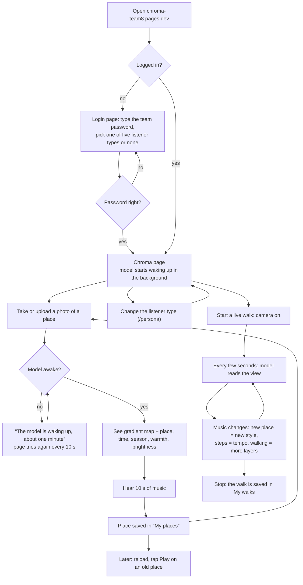

# User-flow diagram · Chroma

What a user does, step by step, and what they see. Code for each step: see the arrow check in [system.md](system.md) and [../README.md](../README.md).

```mermaid
flowchart TD
  A[Open chroma-team8.pages.dev] --> B{Logged in?}
  B -- no --> C[Login page: type the team password,<br/>pick one of five listener types or none] --> D{Password right?}
  D -- no --> C
  D -- yes --> E[Chroma page<br/>model starts waking up in the background]
  B -- yes --> E
  E --> F[Take or upload a photo of a place]
  F --> G{Model awake?}
  G -- no --> H[“The model is waking up, about one minute”<br/>page tries again every 10 s] --> G
  G -- yes --> I[See gradient map + place, time, season, warmth, brightness]
  I --> J[Hear 10 s of music]
  J --> K[Place saved in “My places”]
  K --> L[Later: reload, tap Play on an old place]
  K --> F
  E --> PZ["Change the listener type (/persona)"] --> E
  E --> W[Start a live walk: camera on]
  W --> X[Every few seconds: model reads the view]
  X --> Y[Music changes: new place = new style,<br/>steps = tempo, walking = more layers]
  Y --> X
  Y --> Z[Stop: the walk is saved in My walks]
```
